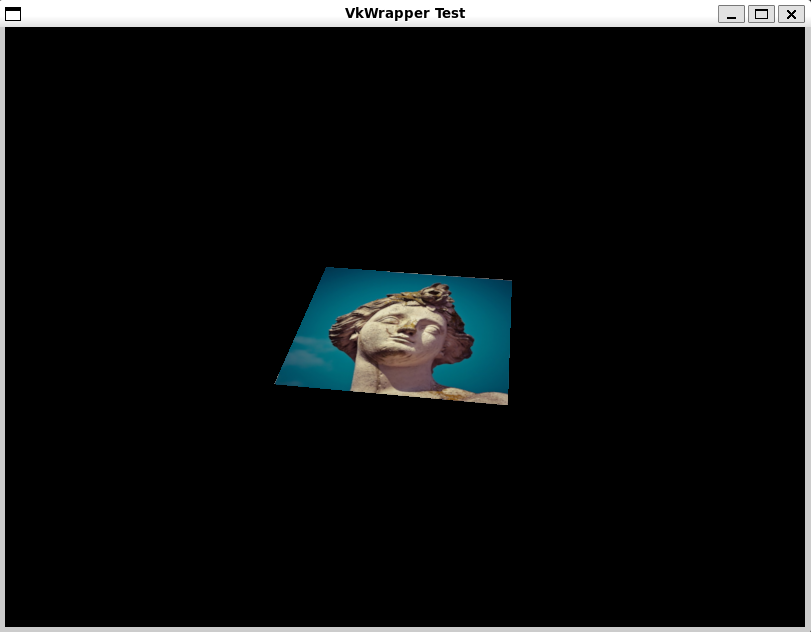

# VkWrapper-Test

This is a test project for the VkWrapper library.

## How to use

1. Clone the repository
2. `git submodule update --init --recursive`
3. `xmake config --mode=release` or `xmake config --mode=debug`
4. `xmake build -y`
5. `xmake run VkWrapper-Test`

## Example output



```sh
$ VkWrapper-Test>xmake run VkWrapper-Test
[2024-12-12 08:33:07.645] [info] VkWrapper config:
VKWRAPPER_VERSION=0.0.0.0
VKWRAPPER_SYSTEM=Windows
VKWRAPPER_COMPILER=MSVC
VKWRAPPER_DEBUG=Release

[2024-12-12 08:33:07.654] [info] available extensions (15):
    VK_KHR_device_group_creation
    VK_KHR_external_fence_capabilities
    VK_KHR_external_memory_capabilities
    VK_KHR_external_semaphore_capabilities
    VK_KHR_get_physical_device_properties2
    VK_KHR_get_surface_capabilities2
    VK_KHR_surface
    VK_KHR_surface_protected_capabilities
    VK_KHR_win32_surface
    VK_EXT_debug_report
    VK_EXT_debug_utils
    VK_EXT_swapchain_colorspace
    VK_NV_external_memory_capabilities
    VK_KHR_portability_enumeration
    VK_LUNARG_direct_driver_loading
```

or on linux:

```sh
[2025-03-11 11:39:17.408] [info] VkWrapper config:
VKWRAPPER_VERSION=0.0.0.0
VKWRAPPER_SYSTEM=Linux
VKWRAPPER_COMPILER=GCC
VKWRAPPER_DEBUG=Release

[2025-03-11 11:39:17.410] [info] available extensions (20):
        VK_KHR_device_group_creation
        VK_KHR_display
        VK_KHR_external_fence_capabilities
        VK_KHR_external_memory_capabilities
        VK_KHR_external_semaphore_capabilities
        VK_KHR_get_display_properties2
        VK_KHR_get_physical_device_properties2
        VK_KHR_get_surface_capabilities2
        VK_KHR_surface
        VK_KHR_surface_protected_capabilities
        VK_KHR_wayland_surface
        VK_KHR_xcb_surface
        VK_KHR_xlib_surface
        VK_EXT_acquire_drm_display
        VK_EXT_acquire_xlib_display
        VK_EXT_debug_report
        VK_EXT_debug_utils
        VK_EXT_direct_mode_display
        VK_EXT_display_surface_counter
        VK_EXT_swapchain_colorspace
```
